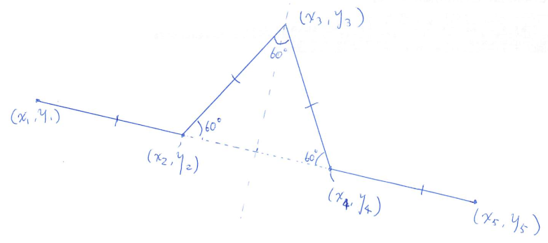
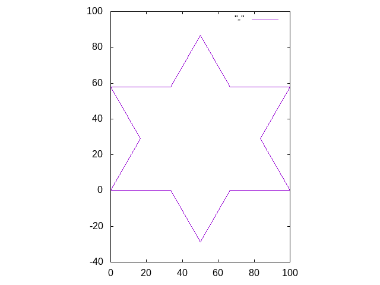
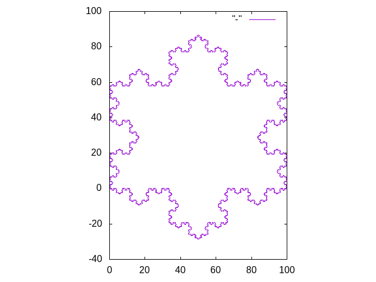

# 【問題と解答】jus共催 第53回シェル芸が好きです。でもゾウさんのほうがもっと好きですシェル芸勉強会

* 問題で使われているデータファイルは[GitHub](https://github.com/ryuichiueda/ShellGeiData/tree/master/vol.53)にあります。クローンは以下のようにお願いします。

```bash
$ git clone https://github.com/ryuichiueda/ShellGeiData.git
```

* 環境: 解答例はUbuntu 20.04 LTSで作成。Macの場合はcoreutilsをインストールすると、GNUのコマンドが使えます。BSD系の人は玄人なので各自対応のこと。

## Q1

次のように100万行、数字のデータを作ってください。

```
$ seq 1000000 | shuf > a
$ head a
706156
560303
355402
439012
600659
668472
410908
162524
779971
```

1列目の数と、5個先の1列目の数を足して、2列目に出力してください。最後の5行は出力しないでください。出力例を示します。

```
706156 1374628   <- 706156 + 668472
560303 971211    <- 560303 + 410908
355402 517926    <- ...
439012 1218983
600659 1511091
668472 1371407
410908 1073319
162524 233618
779971 826294
910432 1621884
・・・
```

### 解答例

```
paste a <(tail -n +6 a) | awk 'NF==2{print $1,$1+$2}'
```

## Q2

`frac`について、1列目を2列目で割って約分してください。出力も1列目が分子、2列目が分母とします。

```
$ cat frac
3240933263267302464930 518871903074343
```

### 解答例

```
$ cat frac | awk '{print "p",$1"/"$2"r"}' | ruby | tr / ' ' | tr -d '()'
568396410 91
$ cat frac | factor |
awk 'NR==1{for(i=2;i<=NF;i++)a[$i]++}NR==2{for(i=2;i<=NF;i++)a[$i]--}END{for(k in a){print k,a[k]}}' |
awk -v a=1 -v b=1 '$2>0{a*=$1^$2}$2<0{b*=$1^(-$2)}END{print a, b}'
568396410 91
```

## Q3

`nums`について、一番下の桁を四捨五入してください。

```
$ cat nums 
-0.327
2.33333
4.0000000000999995
```


### 解答例

```
$ cat nums |
awk -F '' '$NF<5{$NF="";print}$NF>=5{$NF="";$(NF-1)++;print}' |
awk '{while($NF==10){$NF="";$(NF-1)++;NF--}print }' | tr -d ' '
-0.33
2.3333
4.0000000001
```

## Q4

4桁以下のゾロ目でない数を次の手続きで処理すると、必ずある数に収束します。その数を求めてください。

1. 4桁以下のゾロ目でない数`a`を適当に選び、3桁以下なら頭に0を足して4桁にする。
2. `a`の各桁を数字が大きい順にソートして`b`、小さい順にソートして`c`を作る。（例えば`a=0324`なら`b=4320`、`c=0234`）
3. `a=b-c`として2の計算に戻る。


### 解答例

```
$ echo 0032 > a ; cat a ;while : ; do echo $(grep -o . a | sort -r | tr -d \\n) $(grep -o . a | sort | tr -d \\n) | awk '{gsub(/^0*/,"",$1);gsub(/^0*/,"",$2);printf("%04d\n", $1-$2)}' > b ; cat b ; mv b a; done | uniq
0032
3177
6354
3087
8352
6174
$ echo 21 > a; for i in {1..10} ; do cat a | gawk '{print > "/dev/stderr";a=sprintf("%04d",$1);for(i=1;i<5;i++)b[i]=substr(a,i,1);asort(b,c);for(i=1;i<5;i++){d=d c[i];e=e c[5-i]};gsub(/^0*/,"",d);print e-d}' > b ; mv b a ; done
21
2088
8532
6174
6174
6174
6174
6174
6174
6174
### 新開発のjuzを使用 ###
$ echo 3232 | juz 10 gawk '{print > "/dev/stderr";a=sprintf("%04d",$1);for(i=1;i<5;i++)b[i]=substr(a,i,1);asort(b,c);for(i=1;i<5;i++){d=d c[i];e=e c[5-i]};gsub(/^0*/,"",d);print e-d}'
3232
1089
9621
8352
6174
6174
6174
6174
6174
6174
6174
```


## Q5

小問1: ある範囲のふたつの素数をランダムに選んで1行に小さい順に並べ、次のように横向きに等差数列を出力してください。出力する整数の個数は6個としてください。


```
103 773 1443 2113 2783 3453
```

小問2: 小問1の操作を繰り返して、等差数列をランダムに延々と出力させてください。

```
4583 5483 6383 7283 8183 9083
373 6257 12141 18025 23909 29793
5051 7243 9435 11627 13819 16011
3779 7549 11319 15089 18859 22629
3469 6079 8689 11299 13909 16519
3847 6173 8499 10825 13151 15477
191 2683 5175 7667 10159 12651
・・・
```

### 解答例

小問1: 

```
$ primes 2 | head -n 1000 | shuf -n 2 | sort -n | xargs |
awk '{d=$2-$1;for(i=0;i<6;i++)printf $1+d*i" ";print ""}'
1583 3673 5763 7853 9943 12033
```


小問2: 

```
$ while : ; do primes 2 | head -n 1000 |
shuf -n 2 | sort -n | xargs ; done |
awk '{d=$2-$1;for(i=0;i<6;i++)printf $1+d*i" ";print ""}'
4463 6011 7559 9107 10655 12203
2687 2837 2987 3137 3287 3437
2969 5623 8277 10931 13585 16239
5501 5903 6305 6707 7109 7511
3593 4493 5393 6293 7193 8093
・・・
```

## Q6

前問の出力をある程度保存して、横に並んだ数字がすべて素数の行を見つけてください。できる人は保存しないでパイプにつなげて見つけてください。

### 解答例

```
$ while : ; do primes 2 | head -n 1000 |
shuf -n 2 | sort -n | xargs ; done |
awk '{d=$2-$1;for(i=0;i<6;i++)printf $1+d*i" ";print ""}' | head -n 10000 > a
$ cat a | teip -f 3-6 -- factor | awk 'NF==10' | sed -E 's/ [0-9]+://g' 
### 一気にやる方法（コマンドによってはバッファがつまります）###
$ while : ; do primes 2 | head -n 1000 |
shuf -n 2 | sort -n | xargs ; done |
awk '{d=$2-$1;for(i=0;i<6;i++)printf $1+d*i" ";print ""}' |
teip -f 3-6 -- factor | awk 'NF==10{print $1,$2,$4,$6,$8,$10}'
2539 3769 4999 6229 7459 8689
853 3253 5653 8053 10453 12853
・・・
### fflushでバッファしないようにする ###
$ while : ; do primes 2 | head -n 1000 |
shuf -n 2 | sort -n | xargs ; done |
awk '{d=$2-$1;for(i=0;i<6;i++)printf $1+d*i" ";print ""}' |
teip -f 3-6 -- factor | awk 'NF==10{print;fflush()}' | sed 's/ [0-9]*://g'
```

## Q7

`triangle`には正三角形の座標が入っており、次のように`gnuplot`を使うと正三角形が描画できます。

```
$ cat triangle
0 0
50 86.6025
100 0
0 0
$ cat triangle | gnuplot -e 'set terminal png;set size ratio -1;set output "./hoge.png";plot "-" w l'
```

小問1: この、`triangle`の各行間に、次のように3行足して、頂点が6個の星型を描いてください。

* 上の行の座標を`(x1, y1)`、下の行の座標を`(x5, y5)`とする
* 下の絵の`(x2, y2)`、`(x3, y3)`、`(x4, y4)`を計算して、順に出力する



でき上がりの図



小問2: できる人はこの操作を繰り返してコッホ曲線を描画してください。



### 解答例

#### 小問1

```
$ cat triangle | awk 'NR==1{x1=$1;y1=$2}
 NR!=1{x5=$1;y5=$2;
	 a=atan2(y5-y1,x5-x1);r=sqrt((y5-y1)^2+(x5-x1)^2)/3;
	print x1,y1;
	x2=x1+r*cos(a);y2=y1+r*sin(a);print x2,y2;
	print x2+r*cos(a+3.141592/3),y2+r*sin(a+3.141592/3);
	print x5-r*cos(a),y5-r*sin(a);x1=x5;y1=y5}
	END{print x1,y1}' |
gnuplot -e 'set terminal png;set size ratio -1;set output "./six.png";plot "-" w l'
```

#### 小問2

さらに演算を繰り返すとコッホ曲線が描けます。

```
$ cat triangle | juz 5 awk '（略）' |
gnuplot -e 'set terminal png;set size ratio -1;set output "./koch.png";plot "-" w l'
```

